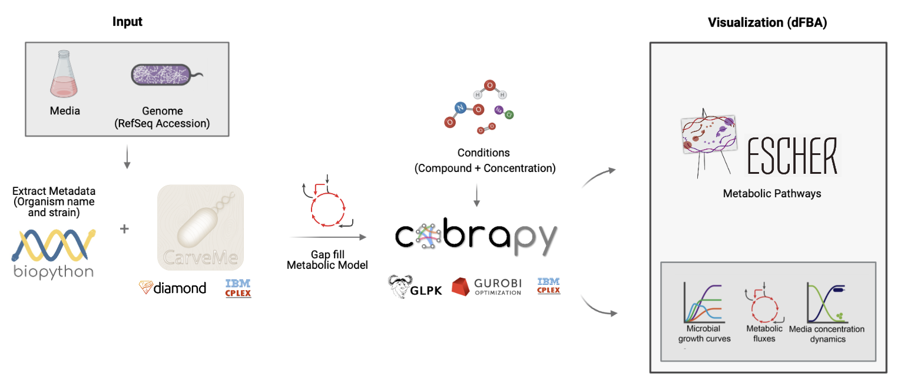

# Visualization and Storage of Gap-filled Microbial Metabolic Networks and Simulated Growth Rates
Flux Balance Analysis (FBA) is a mathematical approach for simulating metabolism in genome-scale reconstructions of metabolic networks. These network reconstructions contain all of the known metabolic reactions in an organism and the genes that encode various enzymes. Using these networks, the following predictions can be made: (1) whether an organism grows under different conditions, (2) the rate at which the organism grows, and (3) the rate at which a metabolite is produced.

Although there are databases such as [BiGG](http://bigg.ucsd.edu) that host curated genome-scale metabolic network reconstructions, there are currently no databases for storing gap-filled models and the results of FBA under various conditions. Our project aims to alleviate this issue and implement novel functionalities by:
* Providing an interactive graphical interface for visualizing gap-filled metabolic networks
* Resolving the static nature of existing databases by providing a dynamic database
* Facilitating the troubleshooting of why an organism grows/does not grow given specific environmental conditions
* Providing graphic visualizations of the simulated growth curves (biomass vs. time) and growth in time and space
* Allowing for querying by organism, media, metabolite, pathway, and reaction

## Pipeline
Key programs/applications that form the framework of this project are [CarveMe](https://github.com/cdanielmachado/carveme), [dFBA](https://pypi.org/project/dfba/), and [Escher](https://escher.github.io/#/). 
  
### CarveMe
Given a RefSeq accession by the user, we use CarveMe to generate (“carve”) a subset of the universal model (a curated network of all possible reactions based on the BiGG database). We store this built model and perform gap filling on it given a media. 
### dFBA
Applying dynamic flux balance analysis (Harwood et al, 2016), a time-dependent metabolic simulation of microbial community is executed. We use plotly for visualizing organism growth rate (results of dFBA) under different conditions (biomass vs. time).
### Escher 
dFBA results will be visualized using Escher via the COBRA model in JSON format. Escher extracts the list of genes to be analyzed from gene data to obtain relevant enzyme information. These gene data and enzyme information is matched to specific chemical reactions in the reaction data which is then used to realize a stoichiometric matrix (a matrix of metabolites and reactions). Using the metabolites as nodes and chemical reactions as edges a metabolic network is generated by Escher.
